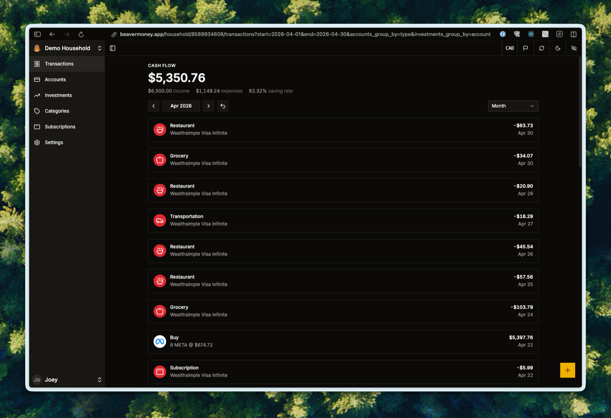
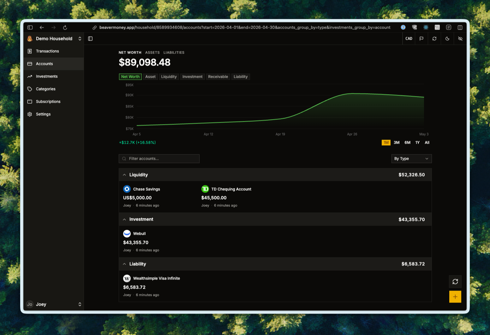
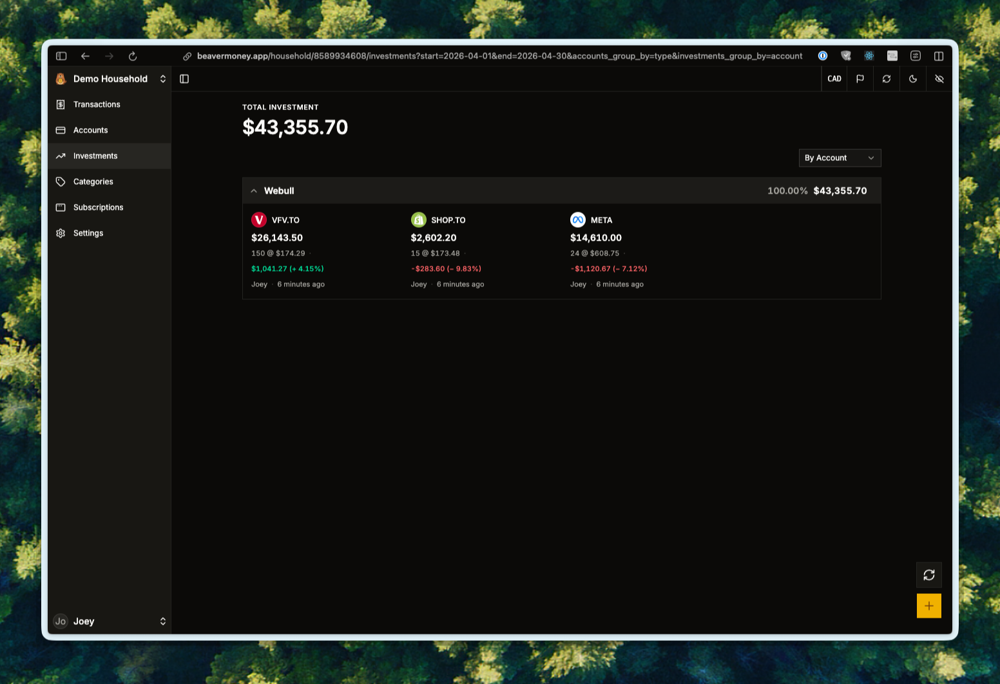
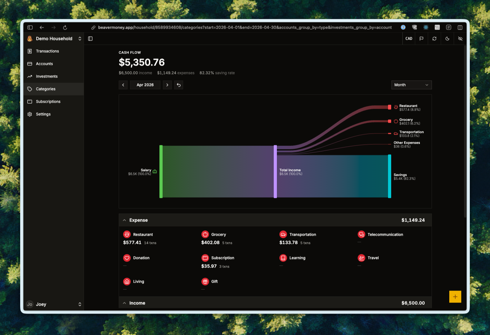

<div align="center">


# Beaver Money

**Log your transactions. Build your dam.**

A personal finance ledger for people who track every transaction by hand, on purpose.

[Try it at beavermoney.app](https://beavermoney.app) · [Self-host](#self-host) · [Discord](https://discord.gg/V6yDJrrJ6h)

[](LICENSE)
[](https://discord.gg/V6yDJrrJ6h)
[](#architecture)

</div>

---

## Why manual logging

Most finance apps want to do the work for you. Plug in your bank, watch the categories auto-fill, look at a number once a month. The work disappears, and so does the awareness.

Beaver Money goes the other way. You type each transaction in. The act of logging it is the point: you notice what you spent, where it went, and how it adds up. After a few weeks the awareness compounds, and the dam is real.

This is a niche, on purpose. If you want auto-import from Plaid or your bank, this isn't the project for you. If you want a careful, private ledger that respects the discipline of writing things down, you're in the right place.

## What it looks like

<!-- Placeholders. Drop real screenshots into docs/screenshots/ and they'll render here. -->

<table>
<tr>
<td width="50%"></td>
<td width="50%"></td>
</tr>
<tr>
<td width="50%"></td>
<td width="50%"></td>
</tr>
</table>

## Features

**Logging**

- Manual cash transactions: income, expense, transfer.
- Manual investment transactions: buy, sell, move.
- Organize your transactions by categories.

**Accounts and investments**

- Five account categories: liquidity, investment, property, receivable, liability.
- Lot-level investment tracking with cost basis per lot.
- Synced market quotes for stocks and crypto.

**Currencies**

- Multi-currency accounts with synced FX rates from [Frankfurter](https://github.com/lineofflight/frankfurter).
- Per-user display currency. Conversion happens on the client from cached household rates, with the original value always one tap away.

**Households**

- Multiple users per household with member, admin, and owner roles.
- Combined or per-user scope on every value, switchable at the household level.

**Privacy and ownership**

- Privacy-mode masking: one toggle hides every numeric value for using the app in public or screensharing.
- Self-hostable. Your data lives where you put it.
- Open source under [AGPL v3](LICENSE).

## Try it

The hosted instance lives at **[beavermoney.app](https://beavermoney.app)**. Sign in with Google, create a household, log a few transactions, and see if the workflow fits.

If you'd rather not put real numbers on someone else's server, jump straight to [Self-host](#self-host).

## Self-host

> Production deployment is a work in progress. Today the supported path is running the development stack locally (or on your own machine in a homelab). A first-class production setup (Dockerfile, `docker-compose.prod.yml`, deploy guide) is on the [roadmap](#roadmap).

The dev stack runs the full app locally with one Postgres, one Redis, and one Frankfurter container. Full setup lives in [docs/development.md](docs/development.md). The short version:

```bash
# Tooling (Go, Node, pnpm, just, atlas, air, watchexec) via mise
mise install

# Frontend dependencies
just install-web

# Env files
cp .env.example .env
cp web/.env.example web/.env

# Generate session and JWT secrets, paste them into .env
openssl rand -base64 32  # SESSION_SECRET
openssl rand -base64 32  # JWT_SECRET

# Backing services (Postgres + Redis + Frankfurter)
just compose up

# Backend (port 3000)
just server

# Frontend (port 5173)
just web
```

Then open <http://localhost:5173>.

The Go server runs migrations and seeds demo data automatically on startup in development mode. Production migrations are managed by [Atlas](https://atlasgo.io/) and need a real database URL: see [docs/development.md](docs/development.md#note-on-database-migrations) and the open production-self-host work.

## Architecture

A monorepo. Go backend serves a single GraphQL endpoint to a React 19 SPA.

| Layer       | Choice                                                         |
| ----------- | -------------------------------------------------------------- |
| Backend     | Go 1.26, Chi v5, JWT + Goth (Google OAuth)                     |
| ORM         | [Ent](https://entgo.io/) with privacy rules per entity         |
| GraphQL     | [gqlgen](https://gqlgen.com/) (`/query` endpoint)              |
| Database    | PostgreSQL 17                                                  |
| Cache       | Redis 8.2                                                      |
| FX rates    | [Frankfurter](https://github.com/lineofflight/frankfurter)     |
| Market data | [EODHD](https://eodhd.com/) (optional) or Yahoo Finance        |
| Frontend    | React 19, Vite, [TanStack Router](https://tanstack.com/router) |
| Data        | [Relay](https://relay.dev/) (no REST, no Apollo)               |
| Styling     | Tailwind CSS 4 + shadcn/ui (`base-mira` style)                 |
| Tools       | [mise](https://mise.jdx.dev/) + [just](https://just.systems/)  |

The codebase is intentionally documented for AI-assisted development:

- [`AGENTS.md`](AGENTS.md): top-level project knowledge base. Where to look for what.
- [`web/AGENTS.md`](web/AGENTS.md): frontend conventions, routing patterns, Relay flows, hook contracts.
- [`gql/AGENTS.md`](gql/AGENTS.md): resolver patterns and GraphQL conventions.
- [`PRODUCT.md`](PRODUCT.md): product strategy, users, anti-references, design principles.
- [`DESIGN.md`](DESIGN.md): visual system. Brand color, typography, components, named rules.

## Why no Plaid?

Same reason the app exists. Auto-import erases the awareness that manual logging creates. The friction of typing it in is the feature.

If that's a dealbreaker, [Monarch](https://www.monarchmoney.com/), [Lunch Money](https://lunchmoney.app/), and [Copilot](https://copilot.money/) are excellent at the auto-import workflow. Beaver Money is for the other crowd.

## Contributing

Issues and pull requests are welcome.

- **Conventions and architecture**: read [`AGENTS.md`](AGENTS.md) (project) and [`web/AGENTS.md`](web/AGENTS.md) (frontend) before touching code. Codegen pipelines for Ent and Relay are documented there.
- **Design**: [`PRODUCT.md`](PRODUCT.md) and [`DESIGN.md`](DESIGN.md) are the source of truth for product and visual decisions. The `$impeccable` skill in [`.agents/skills/impeccable/`](.agents/skills/impeccable/SKILL.md) keeps AI-assisted design work on-brand.
- **Discussion**: the [Discord](https://discord.gg/V6yDJrrJ6h) is the fastest way to ask a question.

## License

[GNU Affero General Public License v3.0](LICENSE).

In plain English: you can run, fork, and modify Beaver Money however you like. If you run a modified version as a network service that other people use, you have to publish your changes under the same license. The point is to keep the project (and any descendants of it) open.
